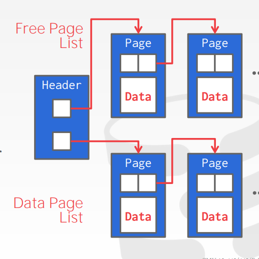
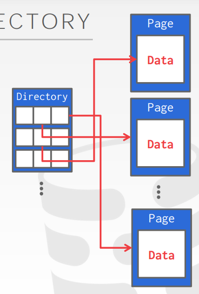
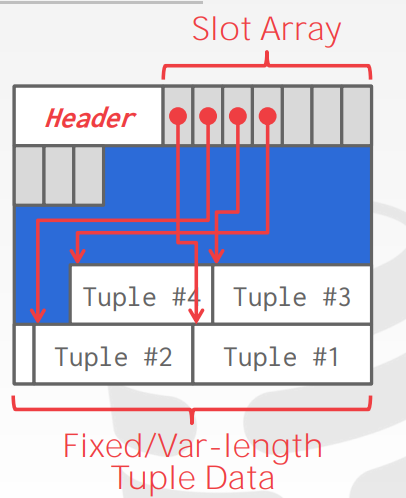
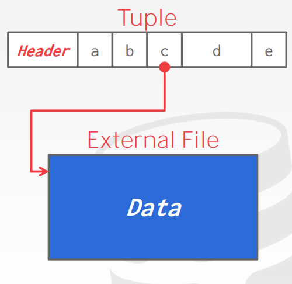
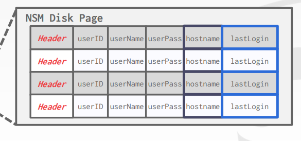
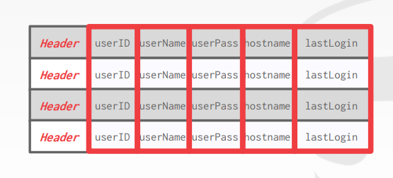
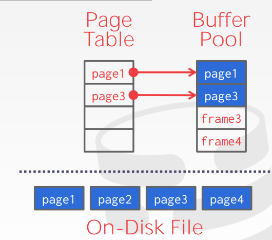

# DBMS note

## advanced sql

- window functions, select ... FUNC_NAME() OVER () ...
  - FUNC_NAME() is Aggregation function, or some special functions. and the OVER() means how to split the rows (no rules by default)
  - it perform function in the groups split by OVER(), maybe not simply aggregate(which group by does)
  - similar to group by, but not exsactly same
  - eg. select *, ROW_NUMBER OVER() as row_number from enrolled;
  - eg. select *, ROW_NUMBER OVER(PARTITION BY cid) from enrolled; it groups the tuples by cid, and shows the row_number in each group

- with xxx as (...)
  - just like "with" in python, and xxx is the temporary table

- recursive function

## DataBase Storage I

- volitile & non-volatile
  - volitile: Random access and byte addressable
    - above SSD: not persistent while out of power
  - non-volitile: sequential access and block addressable
    - SSD and below SSD, this layer is also called "Disk"

- Main purpose
  - provide an illusion for the software  that the data is stored in the memory
  - avoid large stalls, performance degragation

- the OS is not always good for the DBMS
  - os always use mmap to map file page to the virtual memory, and do page flush, page rewite etc. It does memory management directly and knows nothing of the details above. This can be dangerous and unefficient for the DBMS, for example, the dbms konws what query it exactly excecutes and know the best way to excute it while the OS doesn't, when the DBMS do concurrency jobs, it may want some page fixed in the memory etc. so always the dbms wants to control the memory management and do better jobs, it doesn't rely on the operating system.

- how does dbms represent the database in files on disk?
  - file storage
    - how: organise pages
  - page layout
    - how: store pages
  - tuple layout
    - how: pages looks like

- file storage
  - the "storage manager" take responsibillity for nearly everything
    - maintaining files in the file system
    - track read and write
  - page
    - page is a fixed-size block of data
    - page size various from differrnt systems(512B-16KB), while the hardware only guarentee 4KB page write to be atom, which means it may crash when the DBMS tells the disk to write 16KB of pages.
    - type safe: the dbms dosn't care what type of data is stored in a page like (index, row, ...), which means it doesn't care what is inside of the pages.

- page management:
  - different dbms manage pages in files on disk on different ways.
    - heap file organization
      - unordered collections of pages, tuple are stored in random order
      - need some mrta-data to track what pages exsist and which ones have free space
      - represented by: Linked List(dumb)/Page directory
        - bi-directional linked list
          - 

          - cost: search cost is expensive O(n)
        - Page directory
          - 
          - search cost is much lower, but need to keep the directory and data pages in sync.
    - sequential/sorted file organization
    - hashing file organization
  
- page layout
  - how to organize a single page
    - header & data
      - slotted pages: in practice, nobody store tuple from different tables in one page
        - 
    - tuple grows from end to begin, and slot array grows from begin to end
- tuple layout
  - tuples are just sequence of bytes being interpreted by the dbms.
  - layout
    - 
  - denormalization (prejoin): some dbms may store tables related (with foreign keys) in the same page, just to reduce the IO cost of join, but increase the cost of updating
  - tuple identifier
    - dbms manages an identifier for every tuple, it is mostly organized like (pageId, slotId) or sth like that.
    - the upper levels doesn't care about these identifiers, they simply use them to locate a specific tuple but does not care about what the identifier actually is.  
    - these identifiers are not reliable. because they may be frequently changed based on what the dbms application is designed. if a slot is deleted, some dbms applications may leave the slot empty and some may not, that depends.

## Database Storage II

- tuple storage
  - tuples are just sequence of bytes, and is interpreted by the dbms using the catalogs

- data represdentation
  - reals
    - IEEE float point standard
      - fast (CPU has instuctions to process)
      - rounding errors
      - the rounding is performs on the client side
    - fixed precision decimals:
      - used when rounding errors are not acceptable (bank, ...)
      - like varchar, storing what the decimal is exactly is
      - **much slower**
      - stores like a struct
  - tuples are not allowed to exceed the size of a page, what if the data is bigger than a page?
    - use other pages (or other file) to store overflow data and store pointer (or where the data can be found)
      - 

- system catalogs
  - stored in dbms, meta-data about databases contained in
  - has standard

- some models which may be more efficient than the relation model (based on situation)
  - OLTP: online transaction process
    - process small amount of data, use very small amount of the dbms, like the user manipulates his own page, account etc...
  - OLAP: online analysis process
    - manipulating large amount of data. like managing the backend of a whole system
  - n-ary storage: store the tuples continously (Row store)
    - 
    - easy to insert, uodate, delete
    - expensive to scan large portions of data, because the whole page may need to copy to the memory
    - this model is ideal for OLTP, in which the queries tend to operate only small entities, and do insert frequently
  - disconposition storage model
    - 
    - store the value of single column for all tuples continuously (column store)
    - reduces IO costs, but slow down insert, update ...

## Buffer Pools

- how to manage disk write and read
  - spatial control: locality, store pages used together often close to each other physically
  - temporal control: manage when to write and read pages to/from the disk to minimize the number of the stalls

- buffer pool manager
  - buffer pool
    - memory that is organized as an array of fixed size pages, and each page is called a frame
    - 
    - used to store the pages copied from the disk
    - just like cache for the disk pages
    - page table:
      - keep track pf pages, maintain additional meta-page per page
      - dirty flag
        - identifyies a page whether being modified since being load to the memory
      - reference counter(pin counter)
        - identifies how many threads are currently working on this page
        - lock the page and prevent it from being stored back to the disk, because the page may not be safe
    - locks and latches
      - lock in the database has many functions, protect the contents from other **transactions**, held transactions duration, and need to be able to rollback changes. it can be considered as some application level function, it is visible to the user,
      - latches is internal and much low level, it protects the critical sections of dbms's internal data structure from other **threads**, held for operation duration, and do not need to be able to rollback changes
    - multiple buffer pools
      - like per database, per table
      - reduce the latch contention (冲突), if the dbms only has one single buffer pool (accompanied with a buffer table), if one thread is looking up one entry in the buffer table, then other threads trying to acquire the same entry must wait. so multiple buffer pools with reduce latch contention and improve scality.

- DBMS can also prefetch pages based on a query plan (sequential read), load several pages once
- scan sharing
  - one query reuses the data loaded or intermediate results generated by another query (they don't need to be exactly same)
- most dbms use direct IO. which means they do not rely on the OS file system cache
- page replacement policy
  - when the buffer pool is full, some pages which may not be used in the near future will be replaced by new pages on replacement policy
  - LRU policy, clock policy
    - these two policies are susceptible(易受影响的) to sequential flooding (replacing pages to be used by other threads in the near future. The most recently used page is the most unneeded page)
    - LRU-k is better
- handle dirtu pages
  - pages whose dirty flag is 0 can be simply drop out when being evicted
  - pages whose dirty flag is 1 must be written back to the disk, then set dirty flag to 0 or just evict 

## hash table

- We need to organize a data stucture to manage the data stored in the memory/page, for more efficient operations and concurrency concern.

- hash table
  - hash function
    - hash key to hash value, trade off between speed and collison rate
  - hash scheme
    - how to deal with collision
  - facebook xxhash is the best hash function so far (when the key size if very large like 32,64, 128 bytes etc).
  
- some hash schemes, better look up to the slides
  - static hash scheme
    - linear probe(线性探查法)
    - linked list(开散列)
    - robin hood hashing
      - similar to linear probe, every element record the distance to its optimal position. if the distance of the second element(the one to be inserted) is greater than the first one's, then the second one evict the first one to the next slot and take its place.
  - dynamic hash scheme, like .....hard to write.