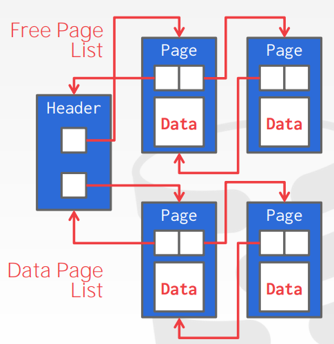

# DBMS note

## advanced sql

- window functions, select ... FUNC_NAME() OVER () ...
  - FUNC_NAME() is Aggregation function, or some special functions. and the OVER() means how to split the rows (no rules by default)
  - it perform function in the groups split by OVER(), maybe not simply aggregate(which group by does)
  - similar to group by, but not exsactly same
  - eg. select *, ROW_NUMBER OVER() as row_number from enrolled;
  - eg. select *, ROW_NUMBER OVER(PARTITION BY cid) from enrolled; it groups the tuples by cid, and shows the row_number in each group

- with xxx as (...)
  - just like "with" in python, and xxx is the temporary table

- recursive function

## DataBase Storage

- volitile & non-volatile
  - volitile: Random access and byte addressable
    - above SSD: not persistent while out of power
  - non-volitile: sequential access and block addressable
    - SSD and below SSD, this layer is also called "Disk"

- Main purpose
  - provide an illusion for the software  that the data is stored in the memory
  - avoid large stalls, performance degragation

- the OS is not always good for the DBMS
  - os always use mmap to map file page to the virtual memory, and do page flush, page rewite etc. It does memory management directly and knows nothing of the details above. This can be dangerous and unefficient for the DBMS, for example, the dbms konws what query it exactly excecutes and know the best way to excute it while the OS doesn't, when the DBMS do concurrency jobs, it may want some page fixed in the memory etc. so always the dbms wants to control the memory management and do better jobs, it doesn't rely on the operating system.

- how does dbms represent the database in files on disk?
  - file storage
    - how: organise pages
  - page layout
    - how: store pages
  - tuple layout
    - how: pages looks like

- file storage
  - the "storage manager" take responsibillity for nearly everything
    - maintaining files in the file system
    - track read and write
  - page
    - page is a fixed-size block of data
    - page size various from differrnt systems(512B-16KB), while the hardware only guarentee 4KB page write to be atom, which means it may crash when the DBMS tells the disk to write 16KB of pages.
    - type safe: the dbms dosn't care what type of data is stored in a page like (index, row, ...), which means it doesn't care what is inside of the pages.

- page management:
  - different dbms manage pages in files on disk on different ways.
    - heap file organization
      - unordered collections of pages, tuple are stored in random order
      - need some mrta-data to track what pages exsist and which ones have free space
      - represented by: Linked List(dumb)/Page directory 
    - sequential/sorted file organization
    - hashing file organization
